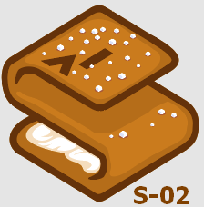

# schematics-02
Schematics Test 02

                  
The following variables are defined for this configuration 

- myparm ... this is the string used for the hello message 
- myparm_sensitive ... a sensitive variable such as password 
- sleeptime ... time the provisioning 'waits'

